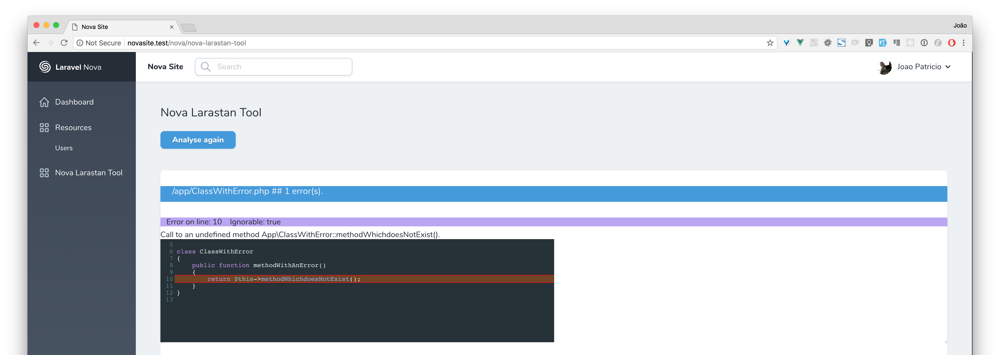
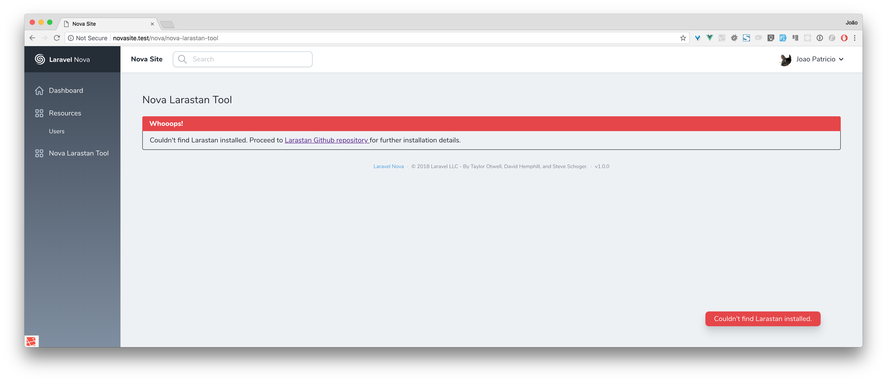

# Nova Larastan Tool

Run Larastan right from your Laravel Nova application



## Installation

You can install the package in to a Laravel app that uses [Nova](https://nova.laravel.com) via composer:

```bash
composer require ijpatricio/nova-larastan-tool
```

Next up, you must register the tool with Nova. This is typically done in the `tools` method of the `NovaServiceProvider`.

```php
// in app/Providers/NovaServiceProvider.php

// ...
public function tools()
{
    return [
        // ...
        new \Ijpatricio\NovaLarastanTool\NovaLarastanTool(),
    ];
}
```

As Larastan is mainly for a dev environment, to keep the dependencies `dev` only, you can setup previous `tools()` method as following:
```php
public function tools()
    {
        $tools = [
            //... your regular tools
        ];

        if (app()->environment() === 'local') {
            $tools = array_merge($tools, [
                //... your require-dev tools
                new \Ijpatricio\NovaLarastanTool\NovaLarastanTool()
            ]);
        }

        return $tools;
    }
```


## Usage

Click on the "Analyse code" button. That's it.

If Larastan is not installed, you will instead see something like this:



Go to [LarastanGithubRepository](https://github.com/nunomaduro/larastan) for installation details.

### Changelog

Please see [CHANGELOG](CHANGELOG.md) for more information what has changed recently.

### Security

If you discover any security related issues, please email ijpatricio (at) gmail dot com instead of using the issue tracker.

## Credits

- [João Patrício](https://github.com/ijpatricio)
- [Nuno Maduro](https://github.com/nunomaduro)

## License

The MIT License (MIT). Please see [License File](LICENSE.md) for more information.
